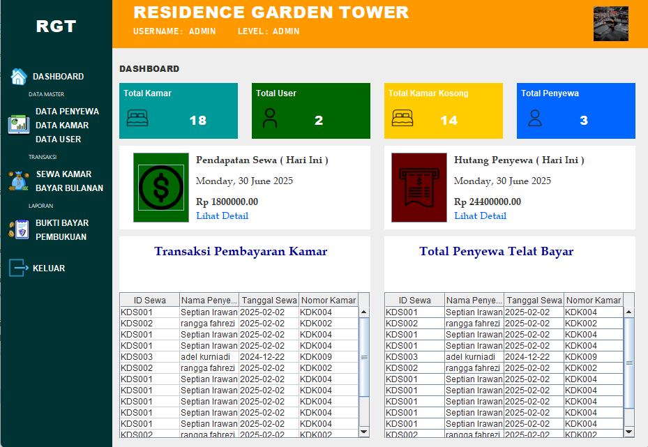

activityDiagram
    start

    partition "Pendaftaran Akun Baru"
    {
        :Pengguna mengklik "Daftar Sekarang";
        :Mengisi formulir pendaftaran (nama, email, password);
        :Mengklik "Daftar";
        if (Validasi Input Berhasil?) then (Ya)
            :Sistem membuat akun;
            :Sistem mengirim email verifikasi;
            note right: Pesan sukses pendaftaran, instruksi verifikasi email
        else (Tidak)
            note right: Notifikasi jika ada kesalahan input
        endif
    }

    partition "Pengisian Formulir Pendaftaran"
    {
        :Pengguna login & mengakses menu "Isi Formulir";
        :Mengisi data pribadi, data orang tua, data sekolah asal;
        :Mengklik "Simpan" atau "Lanjutkan";
        if (Penyimpanan Berhasil?) then (Ya)
            :Sistem menyimpan data;
            :Menampilkan progres pengisian formulir;
            note right: Indikator progres, pesan sukses penyimpanan
        else (Tidak)
            note right: Pesan validasi untuk setiap bidang
        endif
    }

    partition "Unggah Dokumen"
    {
        :Pengguna mengakses menu "Unggah Dokumen";
        :Memilih jenis dokumen;
        :Mengklik "Pilih File";
        :Memilih file dari perangkat;
        :Mengklik "Unggah";
        if (Unggahan Berhasil?) then (Ya)
            :Sistem memproses unggahan;
            :Menampilkan daftar dokumen yang sudah diunggah;
            note right: Status unggahan berhasil
        else (Tidak)
            note right: Status unggahan gagal, ukuran/jenis file tidak diizinkan
        endif
    }

    end

